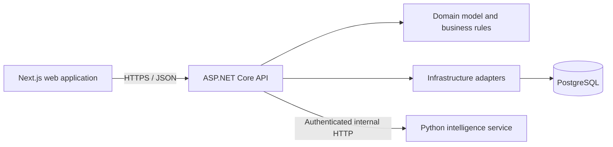

# Farol

[](https://github.com/professionalcasanova/Farol-Inteligente/actions/workflows/backend-ci.yml)
[](https://github.com/professionalcasanova/Farol-Inteligente/actions/workflows/frontend-ci.yml)
[](https://github.com/professionalcasanova/Farol-Inteligente/actions/workflows/python-service-ci.yml)
[](LICENSE)

Farol is an open-source personal finance platform designed around the realities of Brazilian households. It brings accounts, transactions, budgets, recurring bills, CSV imports, and monthly financial guidance into a single application.

The project is also a production-oriented engineering portfolio: a typed Next.js frontend, a modular ASP.NET Core API, PostgreSQL persistence, and an isolated Python service for deterministic financial analysis.

> Farol is under active development. The repository is suitable for local evaluation and technical review; it is not financial advice or a substitute for professional financial planning.

## Product capabilities

- Secure registration, authentication, password recovery, refresh-token rotation, and session management
- Financial account and transaction management
- Monthly budgets and reusable budget templates
- Recurring bills, installments, payment tracking, and cash-flow summaries
- Flexible CSV transaction import with file, row, and content limits
- Monthly health indicators, alerts, and recommended actions
- Community budget sharing with privacy validation and reporting controls
- Responsive web experience for desktop and mobile
- Deterministic analysis service with an explicit, versioned HTTP contract

## Engineering highlights

- Clear boundaries between domain, infrastructure, API, web, and analysis components
- Ownership checks on user-scoped resources to prevent cross-account access
- Password hashing, hashed recovery and refresh tokens, token rotation, and session revocation
- Rate limiting on authentication endpoints and strict production secret validation
- `HttpOnly`, `Secure`, `SameSite=Lax` refresh cookies; access tokens remain in memory
- Restricted CORS, security headers, HSTS, controlled error responses, and upload limits
- Automated backend, frontend, and Python test pipelines
- Dependabot coverage for npm, NuGet, Python, and GitHub Actions

## Architecture



The backend follows a pragmatic layered architecture:

- `Farol.Domain` contains entities, invariants, and business concepts without framework dependencies.
- `Farol.Infrastructure` contains persistence, authentication, email, and external-service implementations.
- `Farol.Api` owns HTTP contracts, authorization, application orchestration, and dependency composition.
- `Farol.Tests` covers domain behavior, API contracts, authorization boundaries, and infrastructure behavior.
- `web` is an independently buildable Next.js application.
- `services/farol_intelligence` is an independently deployable FastAPI service.

More detail is available in [Architecture](docs/architecture.md).

## Technology stack

| Area | Technology |
| --- | --- |
| Web | Next.js 15, React 19, TypeScript, Tailwind CSS, Vitest |
| API | ASP.NET Core 10, C#, JWT bearer authentication, Swagger/OpenAPI |
| Persistence | Entity Framework Core, PostgreSQL |
| Intelligence service | Python 3.11+, FastAPI, Pydantic |
| Delivery | Docker, Render blueprint, Vercel-compatible frontend, GitHub Actions |

## Repository layout

```text
Farol.sln
├── src/
│   ├── Farol.Api/
│   ├── Farol.Domain/
│   └── Farol.Infrastructure/
├── tests/Farol.Tests/
├── web/
├── services/farol_intelligence/
├── docs/
├── scripts/
├── docker-compose.yml
└── render.yaml
```

## Local setup

### Prerequisites

- .NET 10 SDK
- Node.js 22 and npm
- Python 3.11 or newer
- Docker with Docker Compose

### 1. Clone the repository

```bash
git clone https://github.com/professionalcasanova/Farol-Inteligente.git
cd Farol-Inteligente
```

### 2. Start PostgreSQL

```bash
docker compose up -d postgres
```

Docker Compose creates an isolated local database named `farol_dev`. No database files or personal financial records are stored in this repository.

### 3. Start the intelligence service

```bash
cd services/farol_intelligence
python -m venv .venv
```

PowerShell:

```powershell
.\.venv\Scripts\Activate.ps1
python -m pip install -e .
$env:FAROL_ENVIRONMENT = "Development"
$env:FAROL_INTERNAL_API_KEY = "local-development-only-key"
python -m uvicorn app.main:app --reload --port 8000
```

### 4. Start the API

From the repository root, in a separate terminal:

```powershell
$env:ASPNETCORE_ENVIRONMENT = "Development"
$env:FAROL_INTERNAL_API_KEY = "local-development-only-key"
dotnet restore Farol.sln
dotnet run --project src/Farol.Api/Farol.Api.csproj
```

The development configuration uses the local PostgreSQL container and automatically applies migrations. Swagger is available at `http://localhost:5258/swagger`.

### 5. Start the web application

```powershell
Set-Location web
Copy-Item .env.local.example .env.local
npm ci
npm run dev
```

Open `http://localhost:3000`.

## Configuration and data safety

Only safe local defaults and example files belong in source control.

- Real `.env` files are ignored.
- Production connection strings, signing keys, email credentials, and internal API keys must be supplied by the deployment platform.
- `appsettings.json` does not contain a production database connection or signing key.
- `appsettings.Development.json` contains local-only values for the disposable Docker environment.
- PostgreSQL data is stored in a local Docker volume, outside Git.
- Demo scenarios contain synthetic data and are enabled only in the development environment.
- Production startup fails when required secrets are missing or unsafe.

See [Security](SECURITY.md) before deploying or reporting a vulnerability.

## Quality checks

```bash
dotnet test Farol.sln
```

```bash
cd web
npm ci
npm run test
npm run build
```

```bash
cd services/farol_intelligence
python -m unittest discover tests
```

## API and product documentation

- [Documentation index](docs/README.md)
- [Architecture](docs/architecture.md)
- [Authentication and password recovery](README_AUTH.md)
- [Community budgets](README_COMMUNITY_BUDGETS.md)
- [Frontend workspace](web/README.md)
- [Intelligence service](services/farol_intelligence/README.md)
- [Deployment guide](docs/deployment/vercel-render-beta.md)

## Roadmap

- Improve observability and production operations
- Expand automated security and integration testing
- Refine the community budget moderation workflow
- Evolve receipt processing behind stable service contracts
- Add end-to-end browser coverage for critical user journeys

## Contributing

Issues and pull requests are welcome. Keep changes within the existing component boundaries, include tests for behavioral changes, and never commit credentials or personal financial data. See [CONTRIBUTING.md](CONTRIBUTING.md) for the development workflow.

## License

Farol is available under the [MIT License](LICENSE).
