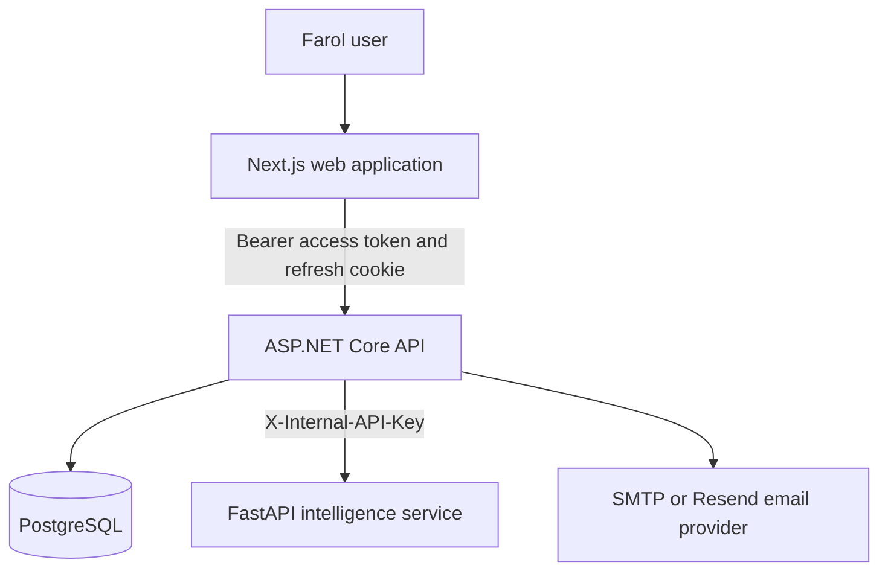
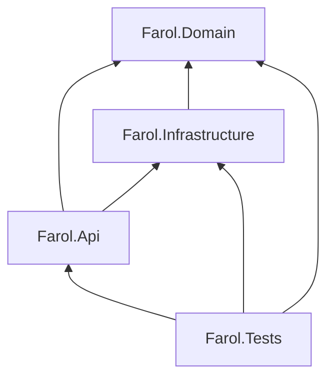

# Architecture

Farol uses a modular monorepo with independently buildable web, API, and financial-analysis components. The design favors explicit contracts and pragmatic boundaries over framework-heavy abstractions.

## System context

The browser never connects directly to PostgreSQL or the intelligence service. The API is the authorization and orchestration boundary.

## Backend dependency direction

### Domain

`src/Farol.Domain` owns financial entities and invariants. It has no dependency on ASP.NET Core, Entity Framework Core, or transport contracts.

### Infrastructure

`src/Farol.Infrastructure` implements persistence, password and token services, transactional email, database migrations, and development seeding.

### API

`src/Farol.Api` exposes versioned HTTP behavior, authenticates callers, enforces resource ownership, applies request limits, and composes infrastructure dependencies.

### Web

`web` is a Next.js App Router application. Its centralized API client translates backend errors, coordinates in-memory access tokens, and uses the API's secure refresh cookie for session continuity.

### Intelligence service

`services/farol_intelligence` evaluates normalized financial snapshots using deterministic rules. It is isolated behind an internal API key and does not access the primary database.

## Security boundaries

- The API derives user identity from validated JWT claims rather than request payloads.
- Queries for private resources include the authenticated user identifier.
- Refresh and password-reset tokens are stored as one-way hashes.
- Authentication endpoints use rate limiting.
- The intelligence service rejects unauthenticated requests outside explicitly configured local development.
- Production secrets and connection strings are injected at runtime and are not committed.
- Uploaded CSV files are constrained by size, extension, content type, row count, and row length.

## Data lifecycle

Local PostgreSQL data is held in a Docker volume. It is not part of the repository, Docker image, or build context. Development demo records are synthetic and are seeded only when the development setting is enabled.

Production migrations may run at startup when explicitly configured. For higher-control environments, migrations should be executed as a separate deployment step.

## Testing strategy

- Domain tests verify entity invariants and financial behavior.
- API integration tests verify response contracts, authentication, authorization, ownership, and rate limiting.
- Infrastructure tests cover token, password, email, and persistence behavior.
- Frontend component tests cover user flows and API integration states.
- Python unit tests cover analysis rules, request validation, authentication, and receipt-processing behavior.
